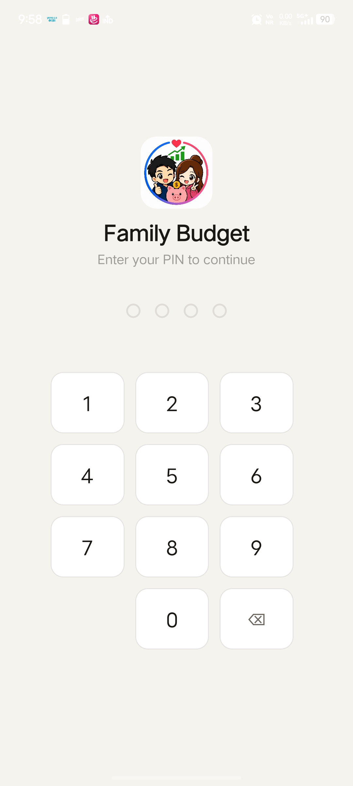
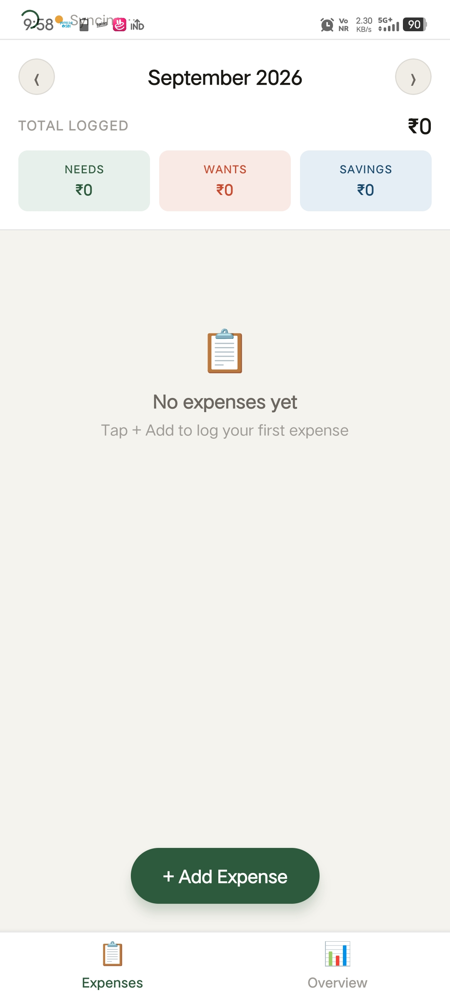
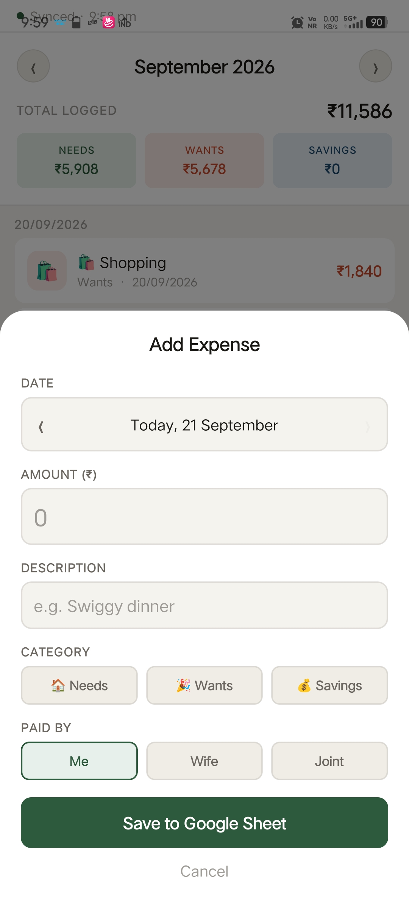
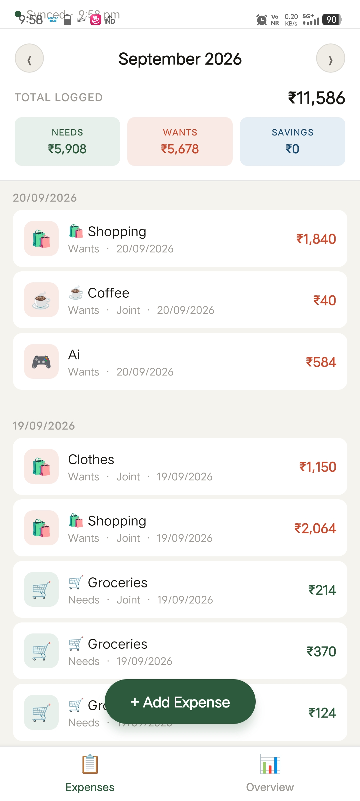
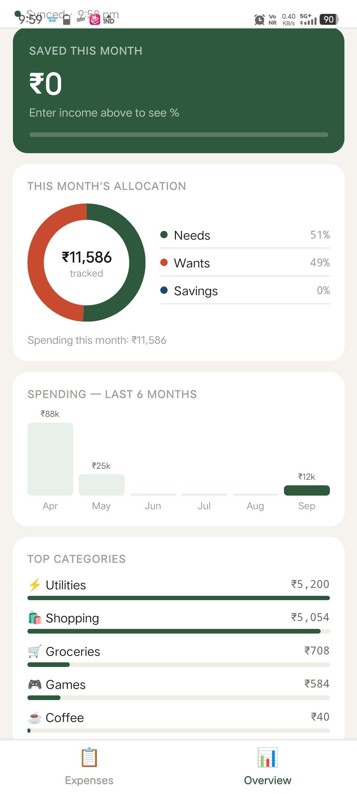

# Family budget

A shared family expense tracker for Android. Two users record daily expenses that synchronize to a Google Sheet through a Google Apps Script web app.

## Features

- PIN lock. Four digit screen lock on open, with escalating lockout periods after repeated wrong entries.
- Expense log. Add expenses with amount, description, category, subcategory, and payer.
- Input sanitization. Sanitizes spreadsheet formula prefixes to prevent cell formula execution in Google Sheets.
- Bounds validation. Enforces amount ceilings and description length limits to prevent sheet corruption.
- Month navigation. Browse expenses by month with a grouped daily view.
- 50/30/20 overview. Proportional donut chart of the Needs, Wants, and Savings split, with monthly income tracking and a savings target bar.
- Six month trend. Bar chart of monthly spending across recent months.
- Automatic sync. Polls every 60 seconds from Google Sheets, with pull to refresh support.
- Explicit sync state. The status bar displays the exact backend error instead of a generic offline label.

## App flow

| PIN lock | Empty state | Add expense | Expenses list | Budget overview |
|---|---|---|---|---|
|  |  |  |  |  |

1. PIN lock: Enter the four-digit PIN to open the app. Successive invalid entries trigger escalating lockout delays.
2. Month view: Browse monthly expense history. An empty state prompts for the first entry when no records exist.
3. Add expense: Open the bottom entry sheet to input amounts, add descriptions, select categories, and attribute payers.
4. Expenses list: Review logged entries organized by day alongside real-time Google Sheets sync status.
5. Budget overview: Track 50/30/20 budget allocations, progress toward monthly savings goals, and six-month spending trends.

## Tech stack

| Layer | Technology |
|---|---|
| Framework | React Native (Expo SDK 57) |
| Runtime | React 19.2, React Native 0.86 |
| Navigation | React Navigation 6 (Bottom Tabs) |
| Charts | react-native-svg |
| Local storage | AsyncStorage |
| Backend | Google Apps Script Web App |
| Database | Google Sheets |
| Test suite | Jest and jest-expo |

## Project structure

```
budgetApp/
├── App.js                       # Root: PIN gate, expense state, sync loop
├── app.json                     # Expo configuration and plugin settings
├── eas.json                     # EAS build configuration
├── INSTALL_APK_GUIDE.md         # Device installation and ADB guide
├── src/
│   ├── constants.js             # Config, validation, colors, categories
│   ├── api.js                   # Google Sheets API: fetch, save, sanitization
│   ├── summary.js               # Budget math (unit tested)
│   └── screens/
│       ├── PinScreen.js         # PIN lock with persisted lockout
│       ├── ExpensesScreen.js    # Expense list and entry modal
│       └── OverviewScreen.js    # Donut chart, savings, trend
├── __tests__/
│   ├── summary.test.js          # Budget calculations and date handling
│   └── security.test.js         # Formula injection defense tests
└── scripts/
    └── purge-git-history.sh     # Scrub leaked secrets from git history
```

## Local setup

1. Clone the repository.

2. Install dependencies:
   ```bash
   npm install
   ```

3. Create `.env` from the template:
   ```bash
   cp .env.example .env && chmod 600 .env
   ```

4. Populate `.env`:
   ```bash
   EXPO_PUBLIC_SHEET_URL=https://script.google.com/macros/s/YOUR_SCRIPT_ID/exec
   EXPO_PUBLIC_PASSWORD=your-api-password
   EXPO_PUBLIC_PIN=0000
   ```

5. Start the local development server:
   ```bash
   npx expo start -c
   ```

For device installation and APK build steps, see [INSTALL_APK_GUIDE.md](INSTALL_APK_GUIDE.md).

## Tests

Run the test suite:
```bash
npm test
```

Twenty-six unit tests cover:
- Money math in `src/summary.js`: category splits, income math, savings progress, month boundaries, and rolling trend calculations.
- Security in `src/api.js`: spreadsheet formula injection neutralization (`=`, `+`, `-`, `@`, `\t`) and round-trip unescaping.

## Environment variables

| Variable | Description |
|---|---|
| `EXPO_PUBLIC_SHEET_URL` | Google Apps Script deployment URL. Must begin with `https://`. |
| `EXPO_PUBLIC_PASSWORD` | API password for backend requests. |
| `EXPO_PUBLIC_PIN` | Four digit unlock PIN. |

Keep `.env` restricted with `chmod 600` and never commit it to source control.

## Security

Read [SECURITY.md](SECURITY.md) before relying on the PIN.

Expo inlines `EXPO_PUBLIC_*` values into the JavaScript bundle at build time. The sheet URL, the API password, and the PIN are recoverable in plain text from any compiled APK. The PIN stops someone holding an unlocked phone from viewing logs, but does not provide database encryption. The API password controls read and write access to the underlying spreadsheet.

## Known limitations

- Mistakes must be edited in the Google Sheet directly. `fetchExpenses` preserves negative amounts so correction entries are possible.
- Network failures abort the write. The app does not cache entries offline for retry.
- All rows load in one request, which slows down as the sheet grows beyond several thousand rows.
- The Overview tab displays the current calendar month and does not contain a month picker.
- Google Sheets stores months 0-indexed (January = 0), matching `Date.prototype.getMonth()`.
- Backend changes require creating a new deployment version in the Apps Script editor. Saving the script alone does not publish updates.
